

<h1 style="color:#154F3C"> 
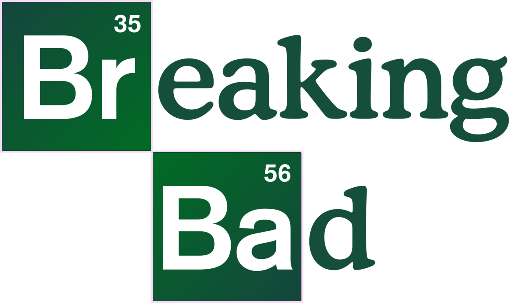
APP</h1>

This App is a tribute to the best series ever.  
Data are stored in internal json files.  

* Characters (Filter option)  
* Deaths (Filter option)  
* Episodes (List and Description) 
* Quotes (With the most iconic photos)

Some Screen Shots : 

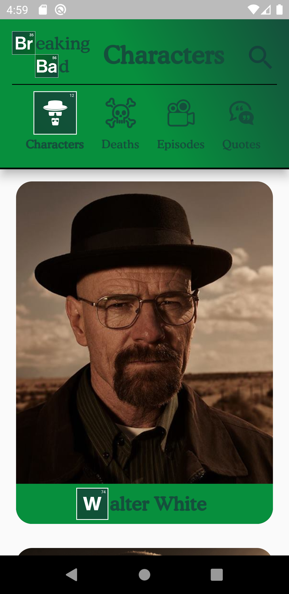
&nbsp;
&nbsp;
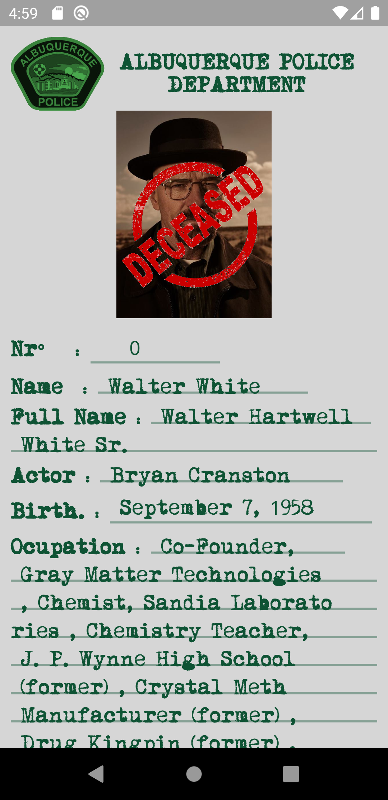
&nbsp;
&nbsp;
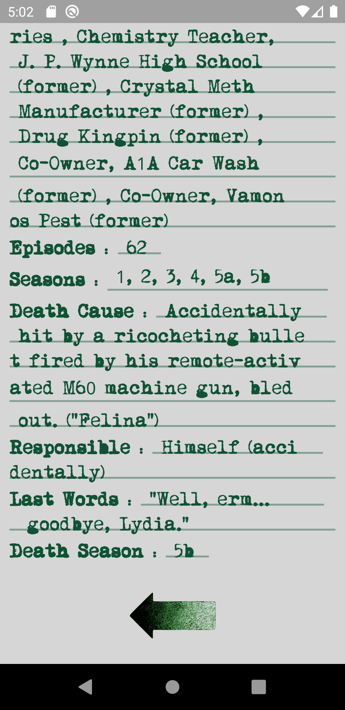

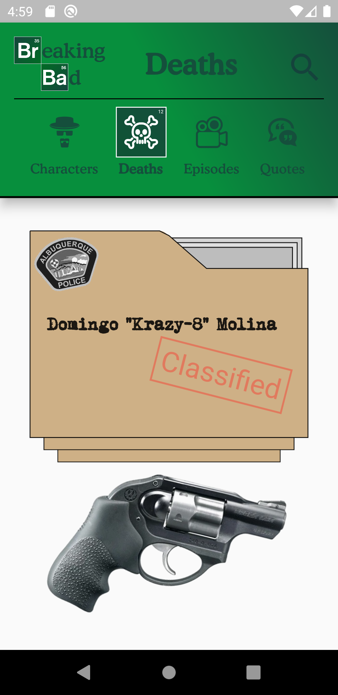
&nbsp;
&nbsp;
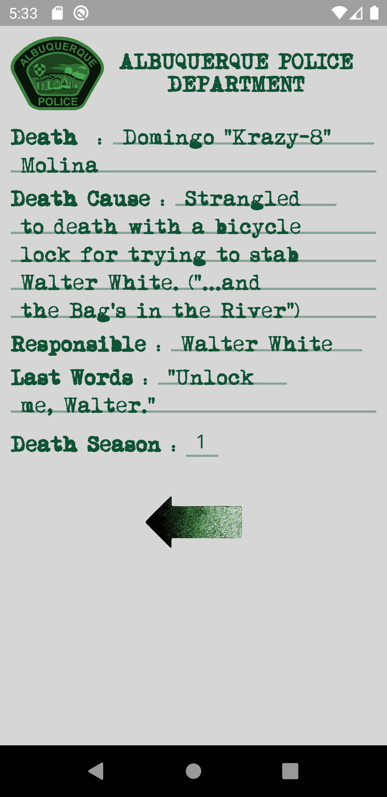
&nbsp;
&nbsp;
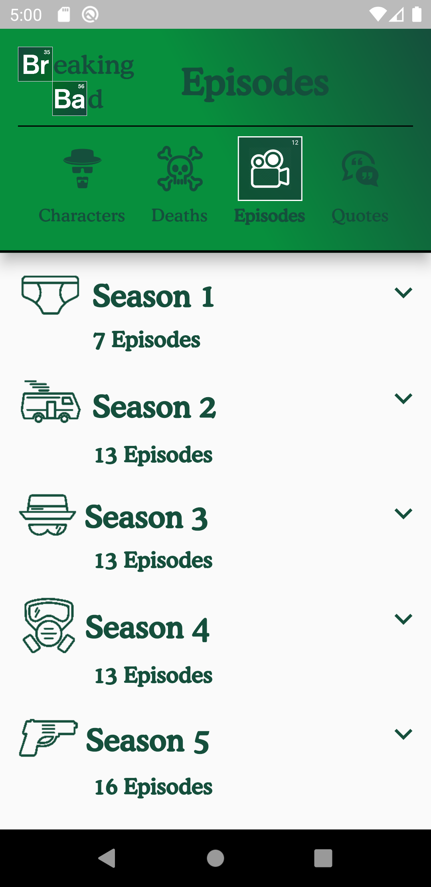

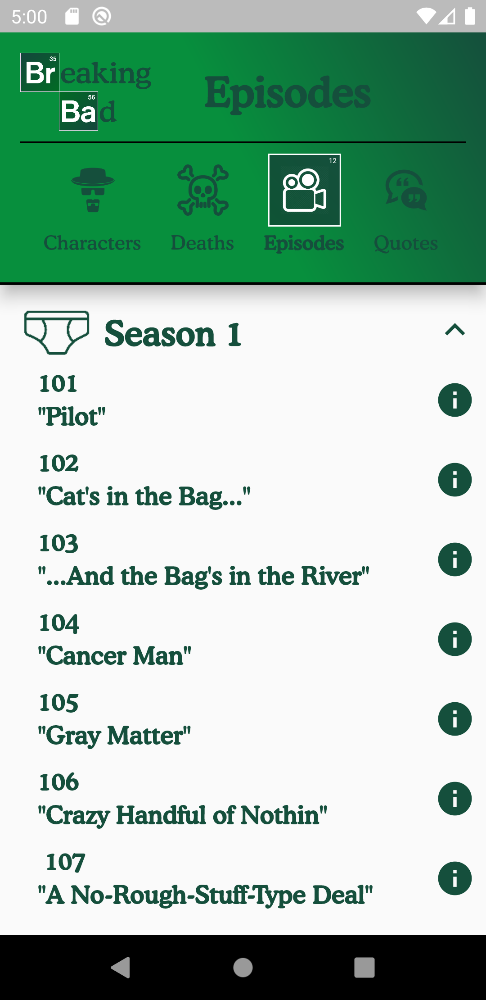
&nbsp;
&nbsp;
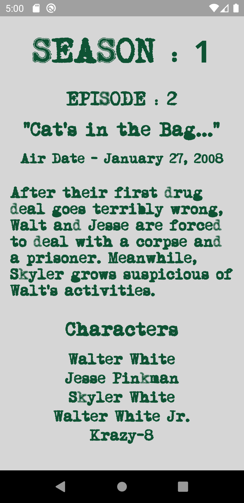
&nbsp;
&nbsp;
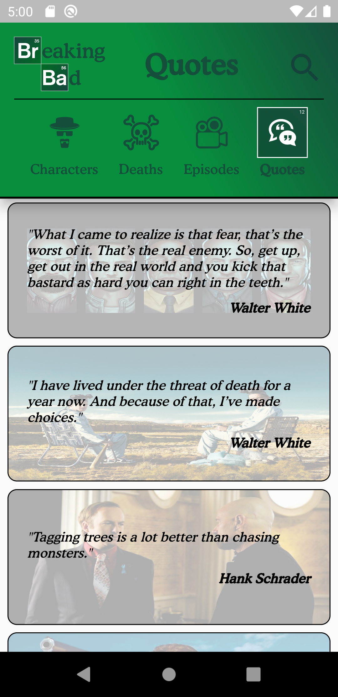

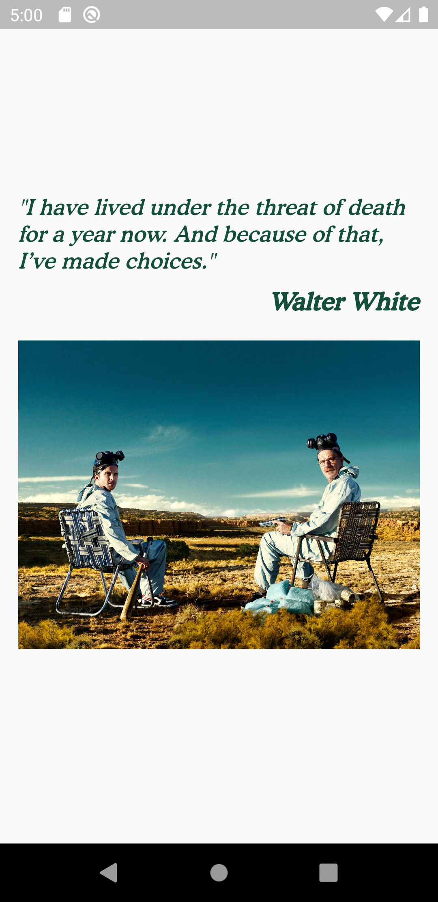
&nbsp;
&nbsp;
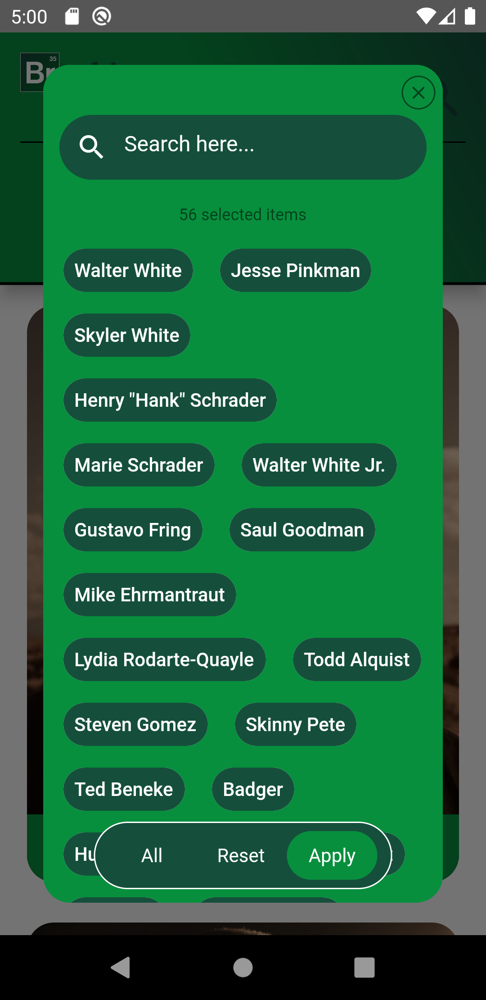
&nbsp;

### Built With  
* [Visual Code Editor](https://code.visualstudio.com)  

### Authors  

* **Nurbol, Islam, Daulet and Dariga**

### License

This project is licensed under the GNU GENERAL PUBLIC LICENSE 3.0 License